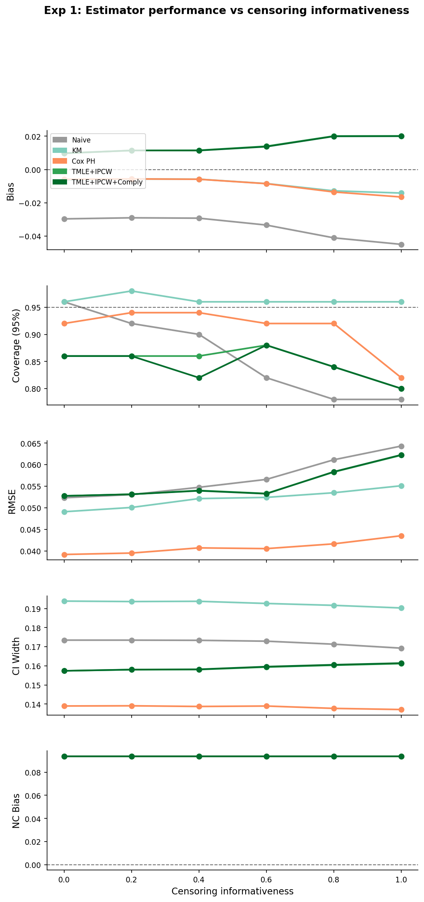
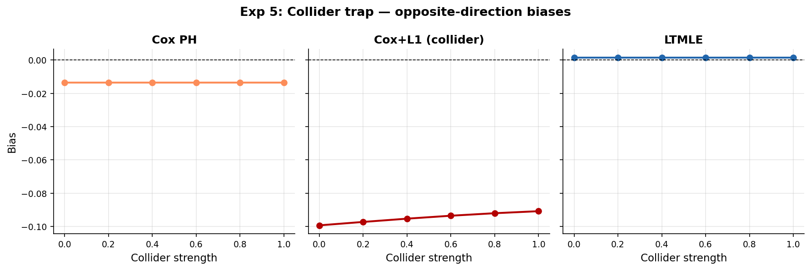
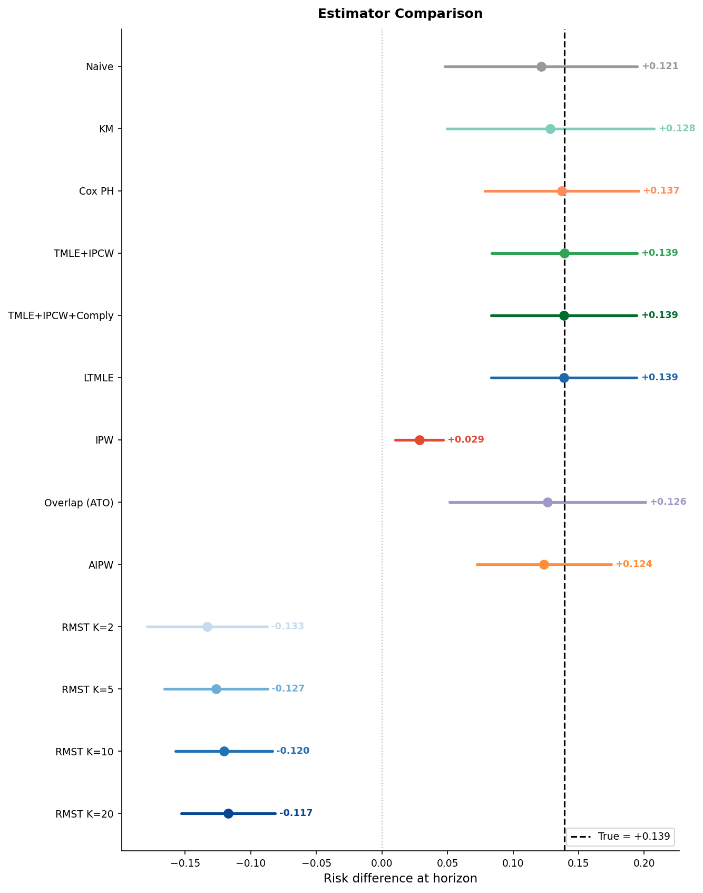

```{r}
#| label: r-init
#| include: false
library(reticulate)
# reticulate auto-detects .venv from the project root; no path needed
```

```{python}
#| label: setup
#| include: false
import warnings
warnings.filterwarnings("ignore")

import numpy as np
import pandas as pd
import matplotlib
matplotlib.use("Agg")
import matplotlib.pyplot as plt

from causal_bench.dgp.config import DGPConfig
from causal_bench.dgp.survival import generate_data, compute_true_effects
from causal_bench.dgp.scenarios import get_scenario, list_scenarios
from causal_bench.estimators import ESTIMATOR_REGISTRY, MVP_ESTIMATORS
from causal_bench.metrics import SimResult
from causal_bench.diagnostics import (
    plot_overlap, plot_love,
    se_calibration_table, plot_se_calibration,
    tipping_point_table, plot_tipping_point,
    ess_across_sims, plot_ess_distribution,
    tipping_point_mnar, plot_tipping_point_mnar,
)
from pathlib import Path

RESULTS_DIR = Path("results")
```

## The problem

A clinical trial reports that the new treatment reduces 12-month event risk by 8 percentage points. You run the same data through five different estimators. You get five different answers. Three of them don't even overlap.

This isn't a software bug. It's a fundamental property of survival data: **censoring, confounding, and time-varying variables interact in ways that invalidate simple approaches**. The question isn't whether your estimator is biased — it's *how much* and *in which direction*.

`causal_bench` makes these failure modes concrete. It generates synthetic clinical trial data under known ground truth, runs a panel of estimators, and measures who gets it right and by how much.

---

## The data-generating process

Each simulated trial follows an accelerated failure time (AFT) model:

$$
\log T_i = \underbrace{0.4 W_{1i} - 0.3 W_{2i} + 0.2 W_{3i} - 0.2 W_{4i}}_{\text{baseline covariates}}
           + \underbrace{0.3 U_i}_{\text{unmeasured}}
           + \underbrace{\tau \cdot A_i}_{\text{treatment}}
           + \varepsilon_i
$$

where $\varepsilon_i \sim \text{Gumbel}(0,1)$ (giving Weibull survival times), $U_i$ is an unmeasured confounder, and $\tau$ is the true log-time-ratio (default $\tau = -0.5$, meaning treatment shortens survival — increases event rate).

Censoring is drawn independently with a calibrated scale factor that hits the target censoring rate at any informativeness level.

```{python}
#| label: fig-dgp-overview
#| fig-cap: "One simulated trial: observed survival times, treatment arms, and censoring"

cfg = DGPConfig(n=500, censoring_informativeness=0.3, seed=42)
df  = generate_data(cfg)

fig, axes = plt.subplots(1, 3, figsize=(12, 3.5))

# Kaplan-Meier curves by arm
from lifelines import KaplanMeierFitter
for ax, (arm, label, color) in zip(
    [axes[0], axes[0]],
    [(1, "Treated", "#E34A33"), (0, "Control", "#3182BD")]
):
    kmf = KaplanMeierFitter()
    mask = df["A"] == arm
    kmf.fit(df.loc[mask, "T_obs"], df.loc[mask, "Delta"], label=label)
    kmf.plot_survival_function(ax=axes[0], color=color, ci_show=False)
axes[0].set_title("Kaplan-Meier by arm")
axes[0].set_xlabel("Time")
axes[0].set_ylabel("S(t)")
axes[0].legend()

# Event time distribution
axes[1].hist(df.loc[df["Delta"] == 1, "T_obs"], bins=30,
             color="#31A354", alpha=0.7, edgecolor="white")
axes[1].set_title("Observed event times (uncensored)")
axes[1].set_xlabel("T_obs")

# Censoring by propensity score
from causal_bench.super_learner import SuperLearner
g_sl = SuperLearner(task="classification", n_folds=3, random_state=0)
g_sl.fit(df[["W1","W2","W3","W4"]].values, df["A"].values)
g = g_sl.predict_proba(df[["W1","W2","W3","W4"]].values)
axes[2].scatter(g, df["T_obs"], c=df["Delta"].map({0:"#999", 1:"#E34A33"}),
                alpha=0.3, s=8)
axes[2].set_title("T_obs vs propensity score")
axes[2].set_xlabel("P(A=1 | W)")
axes[2].set_ylabel("T_obs")

fig.tight_layout()
plt.show()
```

### Key scenario parameters

```{python}
#| label: tbl-scenarios
#| tbl-cap: "Available scenarios and their key parameters"

rows = []
for name in list_scenarios():
    c = get_scenario(name)
    rows.append({
        "scenario": name,
        "n": c.n,
        "censor_info": c.censoring_informativeness,
        "censor_rate": c.censoring_rate,
        "positivity": c.positivity_severity,
        "collider": c.collider_strength,
        "unmeasured": c.unmeasured_confounding_strength,
    })
pd.DataFrame(rows).set_index("scenario").round(2)
```

---

## The estimator hierarchy

```{python}
#| label: tbl-estimators
#| tbl-cap: "Estimators in the registry and their key properties"

rows = [
    ("naive",           "Unadjusted mean difference",         "None",       "No",   "No"),
    ("km",              "Kaplan-Meier risk difference",        "None",       "No",   "No"),
    ("cox",             "Cox G-computation",                   "Covariates", "No",   "No"),
    ("cox_l1",          "Cox G-computation + L1 (collider)",   "Covariates + L1", "No", "⚠ collider bias"),
    ("ipw",             "Horvitz-Thompson IPW",                "Propensity", "No",   "No"),
    ("overlap",         "Overlap weighting (ATO)",             "Propensity", "No",   "Different estimand"),
    ("aipw",            "Augmented IPW (doubly robust)",       "Q + g",      "No",   "No"),
    ("tmle_ipcw",       "TMLE + IPCW",                         "Q + g + G",  "Yes",  "No"),
    ("tmle_ipcw_comply","TMLE + IPCW + compliance",            "Q + g + G",  "Yes",  "No"),
    ("ltmle",           "LTMLE (marginalises over L1)",        "Q + g + G",  "Yes",  "No"),
    ("rmst_k2",         "Pointwise RMST (K=2 grid points)",    "Q + g + G",  "Yes",  "Bias O(1/K)"),
    ("rmst_k20",        "Pointwise RMST (K=20 grid points)",   "Q + g + G",  "Yes",  "Near-exact"),
    ("concrete_RMST",   "concrete direct RMST targeting",      "Q + g + G",  "Yes",  "Requires R"),
]
pd.DataFrame(rows, columns=[
    "estimator", "description", "nuisance models", "IPCW", "notes"
]).set_index("estimator")
```

The hierarchy moves left to right in three dimensions: **covariate adjustment**, **censoring adjustment**, and **targeting**. Each step adds robustness at the cost of complexity. The collider trap (Cox+L1) is the cautionary tale: adding a variable can make things *worse*.

---

## Experiment 1: Censoring informativeness gradient {#sec-exp1}

The simplest failure mode. As censoring becomes more informative (correlated with the outcome), unadjusted estimators accumulate bias. TMLE+IPCW should stay flat.

```{python}
#| label: exp1-run
#| output: false

exp1_dir = RESULTS_DIR / "exp1_censoring"
if not exp1_dir.exists() or not any(exp1_dir.glob("panel.png")):
    import subprocess, sys
    print("Running Exp 1 (n_sims=50, quick mode)...")
    subprocess.run([sys.executable, "experiments/exp1_censoring.py",
                    "--n-sims", "50", "--n-jobs", "-1"], check=True)
```

{#fig-exp1 width=100%}

**What to look for:** Naive and KM bias curves slope upward to the right. TMLE+IPCW bias stays near zero. TMLE+IPCW+Comply is slightly better at high informativeness because compliance carries information about the censoring mechanism.

---

## Experiment 5: The collider trap {#sec-exp5}

The more subtle failure mode. L1 is measured after treatment and before the outcome — a classic time-varying confounder. Two strategies, both wrong:

- **Cox (no L1)**: omits a confounder — biased toward the null
- **Cox+L1**: conditions on a collider — biased *away* from the null, possibly in the opposite direction

LTMLE marginalises over L1 rather than conditioning on it, avoiding the trap entirely.

```{python}
#| label: exp5-run
#| output: false

exp5_dir = RESULTS_DIR / "exp5_collider"
if not exp5_dir.exists() or not any(exp5_dir.glob("collider_panel.png")):
    import subprocess, sys
    print("Running Exp 5 (n_sims=50, quick mode)...")
    subprocess.run([sys.executable, "experiments/exp5_collider.py",
                    "--n-sims", "50", "--n-jobs", "-1"], check=True)
```

{#fig-exp5 width=100%}

**The "impossible choice":** At high collider strength, Cox is biased one way and Cox+L1 is biased the other. A practitioner choosing between them is damned either way. LTMLE is the only correct path — it uses L1 to reduce variance in the outcome model but marginalises it out before estimating the treatment effect.

---

## Experiment 7: The money experiment {#sec-exp7}

All estimators, three Edwards scenarios (optimistic / realistic / pessimistic), 200 simulations each. This is the full picture: who survives realistic conditions?

```{python}
#| label: exp7-run
#| output: false

exp7_dir = RESULTS_DIR / "exp7_edwards"
if not exp7_dir.exists() or not any(exp7_dir.glob("forest_realistic.png")):
    import subprocess, sys
    print("Running Exp 7 (n_sims=50, quick mode)...")
    subprocess.run([sys.executable, "experiments/exp7_edwards.py",
                    "--n-sims", "50", "--n-jobs", "-1"], check=True)
```

{#fig-exp7 width=100%}

### Cross-scenario bias comparison

```{python}
#| label: tbl-exp7
#| tbl-cap: "Bias by estimator and scenario (Exp 7)"

rows = []
for scenario in ["edwards_optimistic", "edwards_realistic", "edwards_pessimistic"]:
    summary_path = exp7_dir / f"summary_{scenario}.md"
    if summary_path.exists():
        # Parse the markdown table into a DataFrame
        lines = [l for l in summary_path.read_text().splitlines()
                 if l.startswith("|") and "---" not in l]
        if len(lines) >= 2:
            header = [h.strip() for h in lines[0].split("|")[1:-1]]
            for line in lines[1:]:
                vals = [v.strip() for v in line.split("|")[1:-1]]
                if vals:
                    row = dict(zip(header, vals))
                    row["scenario"] = scenario.replace("edwards_", "")
                    rows.append(row)

if rows:
    df_exp7 = pd.DataFrame(rows)
    pivot = df_exp7.pivot_table(
        index="estimator", columns="scenario",
        values="bias", aggfunc="first"
    )
    pivot
```

---

## Experiment 8: McCoy RMST experiment {#sec-exp8}

Direct RMST targeting vs pointwise risk-difference estimation — the comparison motivating McCoy's `concrete` R package.

```{python}
#| label: exp8-python
#| fig-cap: "Exp 8 (Python estimators): competing risks scenario"

exp8_dir = RESULTS_DIR / "exp8_mccoy"
if not exp8_dir.exists() or not any(exp8_dir.glob("forest.png")):
    import subprocess, sys
    print("Running Exp 8 (n_sims=50, quick mode)...")
    subprocess.run([sys.executable, "experiments/exp8_mccoy.py",
                    "--n-sims", "50", "--n-jobs", "-1"], check=True)

# Load from Parquet if available
parquet_dir = exp8_dir / "parquet"
loaded = {}
if parquet_dir.exists():
    for f in sorted(parquet_dir.glob("*.parquet")):
        try:
            loaded[f.stem] = SimResult.from_parquet(f)
        except Exception:
            pass

if loaded:
    rows = [r.summary() for r in loaded.values()]
    pd.DataFrame(rows).set_index("estimator").round(4)
elif (exp8_dir / "summary.md").exists():
    from IPython.display import Markdown
    Markdown((exp8_dir / "summary.md").read_text())
```

### R section: concrete direct RMST targeting

::: {.callout-note}
The cells below require R with the `concrete` package installed.
In RStudio, source `r_scripts/concrete_bridge.R` directly — it uses `reticulate`
to call `generate_data()` from Python without writing any files.
:::

```{r}
#| label: r-concrete-setup
#| eval: !expr "requireNamespace('concrete', quietly=TRUE)"
library(concrete)
library(data.table)

source("r_scripts/concrete_bridge.R")
```

```{r}
#| label: r-generate-data
#| eval: !expr "requireNamespace('concrete', quietly=TRUE)"
# py$ objects from the Python cells above are directly accessible here
# Alternatively, call generate_data() fresh from R
cb  <- import("causal_bench.dgp.survival")
cfg <- import("causal_bench.dgp.config")$DGPConfig(
  n                         = 600L,
  competing_risks           = TRUE,
  censoring_rate            = 0.20,
  censoring_informativeness = 0.3,
  true_tau                  = -0.3,
  seed                      = 42L
)
py_df <- cb$generate_data(cfg)
df    <- as.data.frame(py_df)
df$event_type <- as.integer(df$Delta)

cat(sprintf(
  "n=%d  events=%d (%.0f%%)  competing=%d  censored=%d\n",
  nrow(df), sum(df$event_type == 1), 100 * mean(df$event_type == 1),
  sum(df$event_type == 2), sum(df$event_type == 0)
))
```

```{r}
#| label: r-concrete-run
#| eval: !expr "requireNamespace('concrete', quietly=TRUE)"
#| cache: true
result <- tryCatch(
  run_concrete_bridge(df, horizon = 1.0, verbose = FALSE),
  error = function(e) { message("concrete: ", conditionMessage(e)); NULL }
)

if (!is.null(result) && result$converged) {
  cat(sprintf(
    "concrete RMST ATE: %.4f  SE: %.4f  95%% CI: [%.4f, %.4f]\n",
    result$ATE, result$SE, result$CI_lower, result$CI_upper
  ))
} else {
  cat("concrete not installed — install with: remotes::install_github('blind-contours/concrete')\n")
}
```

---

## Diagnostics {#sec-diagnostics}

Before trusting simulation results, three questions are worth asking: Is the propensity model well-identified? Are covariates balanced? Are the reported standard errors believable?

### Propensity overlap and covariate balance

```{python}
#| label: fig-overlap
#| fig-cap: "Propensity score overlap — Edwards realistic scenario"

cfg_diag = get_scenario("edwards_realistic")
df_diag  = generate_data(cfg_diag)
fig = plot_overlap(df_diag)
plt.show()
```

```{python}
#| label: fig-love
#| fig-cap: "Love plot: |SMD| before and after IPW weighting"

fig = plot_love(df_diag)
plt.show()
```

The Love plot shows whether IPW adjustment successfully balances covariates. Values above the dashed 0.1 threshold after weighting indicate residual imbalance — a sign the propensity model may be misspecified or positivity is violated.

### SE calibration

After running simulations, we can check whether each estimator's reported standard errors match the Monte Carlo variance.

```{python}
#| label: fig-se-calibration
#| fig-cap: "SE calibration: median reported SE vs empirical SE (Exp 7 results)"

parquet_dir_exp7 = RESULTS_DIR / "exp7_edwards" / "parquet"
loaded_exp7 = {}
if parquet_dir_exp7.exists():
    for f in sorted(parquet_dir_exp7.glob("*.parquet")):
        try:
            loaded_exp7[f.stem] = SimResult.from_parquet(f)
        except Exception:
            pass

if loaded_exp7:
    fig = plot_se_calibration(loaded_exp7)
    plt.show()
    print(se_calibration_table(loaded_exp7).to_string())
else:
    print("Run Exp 7 first: python experiments/exp7_edwards.py --n-sims 50")
```

Points on the y=x line are perfectly calibrated. Above the line = conservative (wider CIs than needed); below = anti-conservative (CIs too narrow, coverage will be below nominal).

### Tipping-point sensitivity

How much systematic bias would be needed to explain away the Exp 7 results?

```{python}
#| label: fig-tipping
#| fig-cap: "Tipping-point sensitivity — additive bias to shift estimate to null"

if loaded_exp7:
    fig = plot_tipping_point(loaded_exp7)
    plt.show()
    print(tipping_point_table(loaded_exp7).to_string())
else:
    print("Run Exp 7 first.")
```

Longer bars = more robust findings. The SE-unit annotation tells you how many standard errors the estimate sits from the null — a tipping-point of <2 SE is fragile; >4 SE is robust.

### ESS distribution

How much does propensity weighting shrink the effective sample size across simulation draws?

```{python}
#| label: fig-ess
#| fig-cap: "IPW effective sample size distribution — Edwards realistic vs pessimistic"

fig, axes = plt.subplots(1, 2, figsize=(12, 4))
for ax, scenario, title in [
    (axes[0], "edwards_realistic",   "Realistic (positivity=1.5)"),
    (axes[1], "edwards_pessimistic", "Pessimistic (positivity=2.5)"),
]:
    cfg_s = get_scenario(scenario)
    summary = ess_across_sims(cfg_s, n_draws=30, seed=0)
    ax.hist(summary["ess_values"], bins=15, color="#3182BD", alpha=0.7, edgecolor="white")
    ax.axvline(summary["median_ess"], color="#E34A33", linewidth=1.5,
               label=f"Median {summary['median_ess']:.0f} ({summary['ess_pct']:.0f}% of n)")
    ax.axvline(cfg_s.n, color="#31A354", linewidth=1, linestyle="--",
               label=f"Nominal n={cfg_s.n}")
    ax.set_title(title)
    ax.set_xlabel("ESS")
    ax.legend(fontsize=8)
fig.suptitle("ESS distribution across 30 simulation draws")
fig.tight_layout()
plt.show()
```

The ESS drop between realistic and pessimistic scenarios shows why IPW degrades: extreme propensity scores inflate weights, and effective information shrinks well below the nominal sample size.

### MNAR tipping-point

The IPCW adjustment assumes censoring is at most MAR (explainable by observed covariates). How badly would that assumption need to be violated to flip the conclusion?

```{python}
#| label: fig-mnar
#| fig-cap: "MNAR tipping-point heatmap — Edwards realistic scenario (KM estimator)"

cfg_mnar = get_scenario("edwards_realistic")
df_mnar  = generate_data(cfg_mnar)
r_mnar   = tipping_point_mnar(df_mnar, "km", horizon=cfg_mnar.horizon, n_grid=15, seed=42)
fig = plot_tipping_point_mnar(
    r_mnar,
    title=(f"MNAR sensitivity — Edwards realistic\n"
           f"({r_mnar['n_censored_treated'].iloc[0]} censored treated, "
           f"{r_mnar['n_censored_control'].iloc[0]} censored control)")
)
plt.show()
```

The dashed contour is the tipping point — the boundary where the 95% CI crosses zero. The star marks the MAR reference: the event rate we'd expect for censored patients if they were like the observed patients. If the tipping-point contour is far from the star, the result is robust to informative dropout. If it's close, the conclusion depends heavily on the MAR assumption.

---

## Lessons

1. **Censoring bias is monotone and predictable.** MAR censoring (independent of outcome) leaves KM and Cox unbiased. MNAR censoring breaks everything except IPCW-adjusted estimators.

2. **The collider trap has no simple fix.** Omitting L1 biases toward the null; including it biases away. LTMLE is the only escape — but it requires knowing L1 is a post-treatment variable, not a baseline covariate.

3. **Doubly robust ≠ correct.** AIPW and TMLE are consistent if *either* the outcome model or the propensity model is correct. Under strong unmeasured confounding, neither is — and coverage collapses.

4. **Direct RMST targeting (concrete) eliminates discretisation bias.** Pointwise estimators accumulate $O(1/K)$ bias at $K$ time points. Direct RMST targeting removes it entirely. McCoy's `concrete` implements this for competing risks.

5. **Diagnostics are not optional.** ESS below 50% of nominal signals that IPW results are unreliable. SE ratios far from 1 mean coverage will not be nominal. The MNAR tipping-point tells you whether your conclusion survives realistic departures from the missing-at-random assumption. A result that disappears under a small, clinically plausible deviation is not a result worth reporting.

---

## Replication data appendix {#sec-appendix}

Everything needed to reproduce this document, in the reproducible-supplement style of
Brauer & Day (Kruschke/Kurz): the provenance of every figure and number (@sec-provenance),
the software environment and the pinned `concrete` commit (@sec-session), the deterministic
RNG scheme (@sec-rng), a codebook for the simulated scenarios (@sec-scenario-codebook) and for
the estimands and estimators (@sec-estimand-codebook), and the from-scratch build commands
(@sec-reproduce).

::: {.callout-note}
## Appendix scope
This covers the concrete-independent scaffolding (items 1–5 of the appendix plan). The ordinal
codebook (item 6) and the data-availability / DOI + license block (item 7) land with the
ordinal-PRO benchmark (#28) and are gated on `blind-contours/concrete#36`.
:::

### Provenance {#sec-provenance}

Every figure and table traces to an experiment script, the exact command that produces it, the
`results/` artifact it reads, and the notebook chunk that renders it. Rows marked *inline* are
computed at render time from a fresh `generate_data()` draw and persist no artifact. Full
experiments use `--n-sims 200`; the notebook chunks fall back to a 50-sim quick run when the
artifact is absent (see each chunk's guard).

| Output | Rendered by chunk | Experiment script | Command | Artifact |
|---|---|---|---|---|
| @fig-dgp-overview | `fig-dgp-overview` | — (inline) | `generate_data(get_scenario("edwards_realistic"))` | *inline* |
| @tbl-scenarios | `tbl-scenarios` | `dgp/scenarios.py` | registry introspection | *inline* |
| @tbl-estimators | `tbl-estimators` | `estimators/__init__.py` | registry introspection | *inline* |
| @fig-exp1 | `exp1-run` | `experiments/exp1_censoring.py` | `python experiments/exp1_censoring.py --n-sims 200 --n-jobs -1` | `results/exp1_censoring/panel.png` |
| @fig-exp5 | `exp5-run` | `experiments/exp5_collider.py` | `python experiments/exp5_collider.py --n-sims 200 --n-jobs -1` | `results/exp5_collider/collider_panel.png` |
| @fig-exp7 | `exp7-run` | `experiments/exp7_edwards.py` | `python experiments/exp7_edwards.py --n-sims 200 --seed 42` | `results/exp7_edwards/forest_realistic.png` |
| @tbl-exp7 | `tbl-exp7` | `experiments/exp7_edwards.py` | (as @fig-exp7) | `results/exp7_edwards/summary_edwards_{optimistic,realistic,pessimistic}.md` |
| Exp 8 panel | `exp8-python` | `experiments/exp8_mccoy.py` | `python experiments/exp8_mccoy.py --n-sims 200 --n-jobs -1` | `results/exp8_mccoy/{forest.png, parquet/*.parquet, summary.md}` |
| concrete RMST ATE (@sec-exp8) | `r-concrete-run` | `r_scripts/concrete_bridge.R` | `run_concrete_bridge(df, horizon = 1.0)` | *inline* (needs `concrete`) |
| @fig-overlap | `fig-overlap` | `diagnostics.plot_overlap` | inline (edwards_realistic draw) | *inline* |
| @fig-love | `fig-love` | `diagnostics.plot_love` | inline (edwards_realistic draw) | *inline* |
| @fig-se-calibration | `fig-se-calibration` | `diagnostics.plot_se_calibration` | inline (Exp 7 results) | *inline* |
| @fig-tipping | `fig-tipping` | `diagnostics.plot_tipping_point` | inline | *inline* |
| @fig-ess | `fig-ess` | `diagnostics.plot_ess_distribution` | inline | *inline* |
| @fig-mnar | `fig-mnar` | `diagnostics.plot_tipping_point_mnar` | inline | `results/edwards_realistic/mnar_tipping_point.png` |

: Provenance — figure/number → script → command → artifact → render chunk {#tbl-provenance}

### Software environment {#sec-session}

A `sessionInfo()`-equivalent, captured live at render. Because the concrete results in @sec-exp8
depend on *unmerged* `concrete` PRs, the pinned commit — not the package version — is the
reproducibility linchpin: record the `@<sha>` printed below alongside any number you cite.

```{python}
#| label: session-info-py
#| tbl-cap: "Python environment captured at render time"
import sys, platform, subprocess
import importlib.metadata as im

def _ver(pkg):
    try:
        return im.version(pkg)
    except Exception:
        return "—"

pkgs = ["numpy", "scipy", "pandas", "scikit-learn", "lifelines",
        "matplotlib", "joblib", "rpy2", "pydantic", "pandera", "pyarrow"]
env = {"python": sys.version.split()[0], "platform": platform.platform()}
env.update({p: _ver(p) for p in pkgs})

try:
    env["causal_bench commit"] = subprocess.run(
        ["git", "rev-parse", "--short", "HEAD"],
        capture_output=True, text=True, check=True).stdout.strip()
except Exception:
    env["causal_bench commit"] = "—"
env["causal_bench version"] = _ver("causal_bench")

pd.DataFrame({"version": env}).rename_axis("component")
```

```{r}
#| label: session-info-r
cat(R.version.string, "\n\n")
pin <- function(pkg) {
  if (!requireNamespace(pkg, quietly = TRUE)) return(sprintf("%-12s not installed", pkg))
  d   <- packageDescription(pkg)
  sha <- d$RemoteSha; if (is.null(sha)) sha <- d$GithubSHA1; if (is.null(sha)) sha <- ""
  sprintf("%-12s %s%s", pkg, d$Version,
          if (nzchar(sha)) paste0("  @", substr(sha, 1, 10)) else "")
}
for (p in c("reticulate", "data.table", "concrete")) cat(pin(p), "\n")
```

::: {.callout-important}
## The `concrete` pin is the reproducibility linchpin
The `concrete` line above is empty (`not installed`) or shows a `@<sha>` — the RMST results in
@sec-exp8 are only reproducible against that exact commit, because they depend on the unmerged
`blind-contours/concrete#36`. When #36 merges, re-pin to the merge commit and update this note.
:::

### Seeds and RNG {#sec-rng}

Every simulated figure is a deterministic function of a single integer seed. `DGPConfig.seed`
defaults to **42**; `generate_data()` draws from `np.random.default_rng(config.seed)`, and the
auxiliary streams (censoring, competing risks) derive from `config.seed ^ 0xDEADBEEF` so they are
independent yet equally reproducible. Re-running any experiment script with the same `--seed`
reproduces its artifact bit-for-bit.

The DGP additionally provides a SHA-256-**keyed** draw primitive (`dgp/keyed_random.py`, after
Buffalo et al. 2026). Rather than consuming a stateful stream in generation order, each draw is a
pure hash of its key:

$$\texttt{keyed\_uniform}(i, e, s, \text{seed}) = \frac{\text{SHA256}(\texttt{"seed:i:e:s"})_{[0:8]}}{2^{64}}$$

for patient `i`, event type `e`, scenario `s`. This makes a draw independent of evaluation order:
adding a patient, reordering the cohort, or parallelising across workers leaves every other
patient's draws untouched — a guarantee a stateful `default_rng` cannot give. That
order-independence is a stronger reproducibility story than a stated seed. It is the RNG path
wired into the ordinal-PRO DGP (#26); the survival DGPs above still seed via `default_rng`.

```{python}
#| label: rng-demo
from causal_bench.dgp.keyed_random import keyed_uniform

# Same key → same draw, in any order, at any call count
u1 = keyed_uniform(patient_id=17, event_type="T_event", scenario="edwards_realistic", seed=42)
u2 = keyed_uniform(patient_id=17, event_type="T_event", scenario="edwards_realistic", seed=42)
assert u1 == u2
print(f"patient 17 · edwards_realistic · seed 42 → {u1:.6f}")
```

**Reproduce a specific figure.** Each figure is a pure function of its script, this repo's commit
(@sec-session), and `--seed`. To regenerate @fig-exp7 exactly:

```bash
python experiments/exp7_edwards.py --n-sims 200 --seed 42   # → results/exp7_edwards/
```

### Scenario codebook {#sec-scenario-codebook}

The "data" here is simulated, so we document it like a codebook. @tbl-scenarios lists the headline
knobs; @tbl-scenario-codebook is the exhaustive dictionary — every scenario in `dgp/scenarios.py`,
introspected from the live registry (so it cannot drift from the code), showing only the DGP
parameters that differ from the `clean` baseline (`n=500`, `true_tau=−0.5`, no corruptions). A
blank cell means "equals baseline."

```{python}
#| label: tbl-scenario-codebook
#| tbl-cap: "Scenario codebook — DGP parameters per scenario (differences from the `clean` baseline; blank = baseline)"
from causal_bench.dgp.scenarios import list_scenarios, get_scenario

def _flatten(name):
    d = get_scenario(name).model_dump()
    cens = d.pop("censoring", {}) or {}
    d["censoring_kind"] = cens.get("kind")
    d["censoring_informativeness"] = cens.get("informativeness")
    return d

base = _flatten("clean")
records = {}
for name in list_scenarios():
    d = _flatten(name)
    row = {k: v for k, v in d.items() if k != "seed" and v != base.get(k)}
    row["n"] = d["n"]                      # always show cohort size
    row["true_tau"] = d["true_tau"]        # …and the true effect
    records[name] = row

codebook = pd.DataFrame(records).T
front = ["n", "true_tau"]
codebook = codebook.reindex(
    columns=front + [c for c in codebook.columns if c not in front])
codebook = codebook.dropna(axis=1, how="all").fillna("").astype(object)
codebook.rename_axis("scenario")
```

The DGP knobs referenced above:

| Parameter | Meaning | Range / values |
|---|---|---|
| `n` | cohort size | `[1, 100000]`, default 500 |
| `true_tau` | true treatment effect (log-hazard; <0 delays the event) | default −0.5 |
| `treatment_prevalence` | marginal `P(A=1)` via propensity intercept | `[0, 1]`, default 0.5 |
| `positivity_severity` | strength of propensity extremes (near-violations) | `≥0`, documented `[0, 3]` |
| `unmeasured_confounding_strength` | magnitude of the latent confounder `U` | `≥0`, documented `[0, 0.8]` |
| `outcome_nonlinearity` | nonlinearity in the outcome model | default 0 |
| `effect_heterogeneity` | linear CATE modifier on `W1` (excludes `subgroup_*`) | default 0 |
| `horizon` | RMST / evaluation horizon | `>0`, default 1.0 |
| `censoring_rate` | marginal censoring fraction | `[0, 1)`, default 0.25 |
| `censoring_kind` | mechanism: `covariate_dependent` (MAR ∣ W,A), `latent_confounder` (MNAR via U), `informative` (on T), `independent` | — |
| `censoring_informativeness` | strength of the censoring mechanism | `[0, 1]` |
| `crossover_rate` | treatment-crossover fraction | `[0, 1]` |
| `collider_strength` | post-treatment confounder `L1` effect (collider) | `[0, 1]` |
| `competing_risks` | enable the cause-2 competing event | bool |
| `cause2_treatment_effect` | treatment effect on the competing hazard (needs `competing_risks`) | default 0 |
| `hfh_death_escalation` | shared-frailty coupling (HFH-prone die sooner; needs `competing_risks`) | `[0, 2]` |
| `enrollment_drift` | time trend in the enrolled population | `[0, 1]` |
| `strata_cols` / `strata_block_size` | permuted-block randomization within strata | cols ⊆ {W1…W4}; block even `≥2` |
| `subgroup_col` / `cate_high` / `cate_low` | explicit binary-subgroup step CATE (all-or-none) | col ⊆ {W1…W4} |
| `seed` | RNG seed (see @sec-rng) | default 42 |

: DGP parameter dictionary {#tbl-dgp-params}

### Estimand and estimator codebook {#sec-estimand-codebook}

@tbl-estimators lists the estimators as an adjustment hierarchy; this codebook is
estimand-first — each target parameter, its definition, and the registry estimators that
target it. Estimators score against *their own* estimand (an RMST estimator is not judged on a
risk-difference target). `concrete_*` and `clinical_*` estimators require R with the `concrete`
package (@sec-reproduce); the rest are pure Python.

| Estimand | Definition | Registry estimator(s) | Backend |
|---|---|---|---|
| Risk difference at horizon $\tau$ | $P(T\le\tau\mid A{=}1) - P(T\le\tau\mid A{=}0)$ | `naive`, `km`, `cox`, `cox_l1`, `ipw`, `aipw`, `tmle_ipcw`(+`_cv`/`_boot`/`_comply`), `ltmle` | Python |
| RMST difference | $E[\min(T,\tau)\mid A{=}1] - E[\min(T,\tau)\mid A{=}0]$ | `rmst_k{2,5,10,20}` (pointwise, $O(1/K)$ bias), `concrete_RMST`(`_strata`) (direct targeting), `concrete_simult` (joint $t{=}1,2$) | Python; `concrete_*` need R |
| Overlap-weighted ATE (ATO) | risk difference on the overlap population (weights $A(1{-}e)+(1{-}A)e$) | `overlap` | Python |
| Win ratio (GPC) | favorable : unfavorable pairwise-comparison ratio over the ordered composite (death > HF hospitalization > PRO); win-ratio ATE/ATT | `concrete_WR_direct`, `concrete_WR_plugin` | R + `concrete` |
| Restricted mean time in favorable state (RMT-IF) | expected time spent in the favorable multistate stratum up to $\tau$ | `clinical_RMTIF` | R + `concrete` |
| Priority-standardized net benefit (PSNB) | priority-ranked net-benefit / win-ratio variant | `clinical_PSNB` | R + `concrete` |
| CATE / subgroup effect | conditional risk difference within a subgroup | `effectxshift`, `bcf_bart` | Python |
| Cumulative log-OR (ordinal) | $\log\text{OR}$ for the $P(Y\ge k)$ contrast, constant across $k$ under proportional odds | Bayesian CLMM (#27) | Python (bambi/PyMC) |

: Estimand codebook — target parameter → definition → estimator {#tbl-estimand-codebook}

::: {.callout-note}
The cumulative-log-OR row is the ordinal-PRO benchmark's target: its estimator (the Bayesian
CLMM, #27) and the head-to-head against the win ratio (exp25, #28) land with the benchmark,
gated on `blind-contours/concrete#36`.
:::

### Reproducing from scratch {#sec-reproduce}

```bash
# Install
pip install -e ".[storage]"       # adds pyarrow
pip install -e ".[r]"             # adds rpy2 (requires R installed)

# Quick run (50 sims, ~2 min) with full diagnostics
python -m causal_bench --scenario edwards_realistic --n-sims 50 \
    --diagnostics --tipping-point --ess \
    --mnar-tipping-point --mnar-estimator km --mnar-grid 10

# Full experiments (the artifacts in @tbl-provenance)
python experiments/exp1_censoring.py --n-sims 200
python experiments/exp5_collider.py  --n-sims 200
python experiments/exp7_edwards.py   --n-sims 200
python experiments/exp8_mccoy.py     --n-sims 200   # concrete results need R

# Render this notebook (requires quarto)
quarto render index.qmd
```

R setup (for the `concrete` cells in @sec-exp8):

```r
install.packages("remotes")
remotes::install_github("blind-contours/concrete")  # McCoy's package
install.packages(c("reticulate", "data.table"))
```
